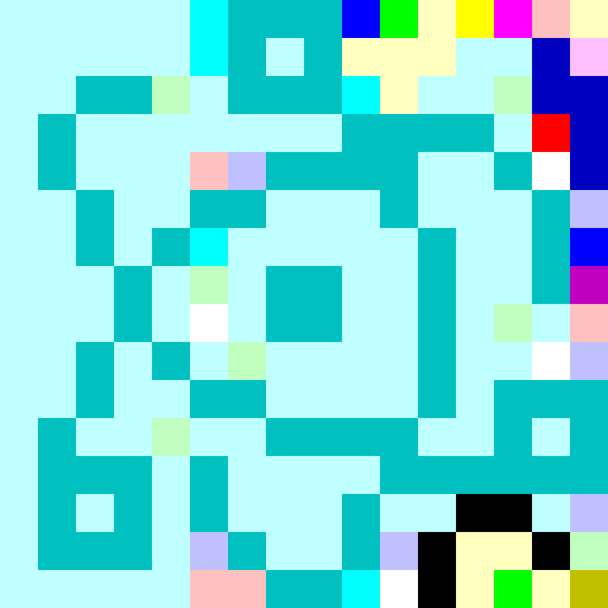
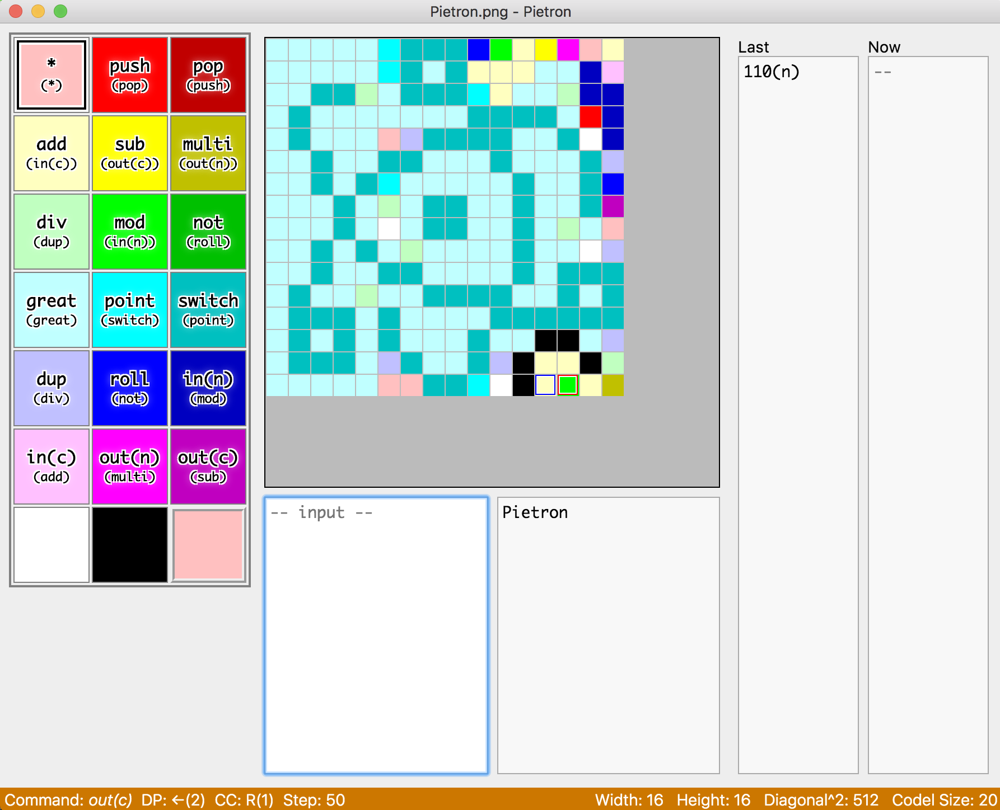

# Pietron

Cross-platform IDE for Piet.

## Description

Pietron is a cross-platform IDE for editing and debugging the source code of "Piet", an esoteric programming language.

The specification of Piet is [here](http://www.dangermouse.net/esoteric/piet.html).

Pietron is developed with [Electron](https://electronjs.org/) and named after it.

## ScreenShot

## Usage

### Editor

- Draw free lines by dragging on the canvas. 

- Select a color by clicking on the palette and the selected is shown at the bottom-right corner.

- Change the color to draw with by clicking on the palette.

  - The commands are shown in each color on the palette.

  - The bare one is from * (origin) and the parenthesized one is to *.

  - Change the * color by right-cicking on the palette.

- Pick a color by right-clicking on the canvas.

- Change the canvas size one by one with CTRL+ALT+[↑↓←→] (⌥⌘ on OSX).

  - Also specify the exact width and height with CTRL(⌘)+R.

- Undo/Redo support (CTRL(⌘)+Z / CTRL+Y(⇧⌘Z)).

- Zoom support (CTRL(⌘)+";" / CTRL(⌘)+"-").

### Debugger

- "Start Debug" executes commands until the program terminates (F5).

  - When the commands are executed over 1,000,000 times, a comfirmation dialog will be displayed.

- "Jump Debug" excutes the specified number of commands (F6).

- "Step Debug" excutes a next command (F7).

- "Stop Debug" stops the execution (ESC).

- While debugging, the source codel and the destination codel are indicated by red and blue borders.

- 🎨Emoji🐛 Support.

### File I/O

- PNG/BMP support.

- Codel size specification support.

- Non piet colors are dealed as white.

## Install

Download zipped files for your operating system from [releases](https://github.com/dnek/pietron/releases).

Executable files are contained in them.

## Author

- **dnek** - *Piet lover* - [dnek](https://github.com/dnek)

## License

This project is licensed under the MIT License - see the [LICENSE.md](LICENSE) file for details.

## TODOs

- Canvas with HTML5 `<canvas>`.

- Editor Selection mode.

- Move with arrow keys on the canvas.

- Command preview on the canvas.

- Breakpoint.

- File drag & drop.

- Set the limits of stack & integer.

- Debug log.

## Acknowledgments

- [Pidet](https://github.com/dnek/Pidet) is my previous product and I do not recommend using it.

  - Japanese only.

  - Windows support only.

  - No Emoji support.

  - Not maintained.